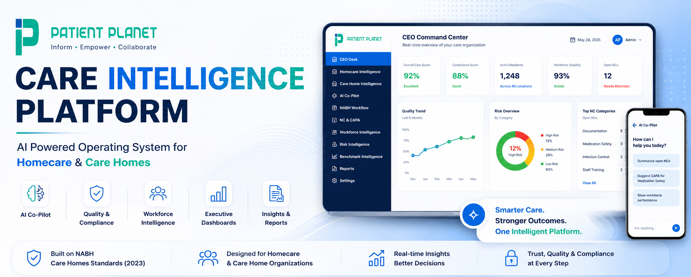

<p align="center">
  
</p>

An AI-powered operating system for Homecare and Care Homes, built to transform quality, compliance, workforce, and executive decision making
## The Intelligence Layer for Modern Care Organizations

Patient Planet Care Intelligence Platform is building the intelligence layer for the care economy.

It is an AI-powered operating system that enables homecare providers and care homes to manage operations, quality, workforce, compliance, and executive decision making from a single platform.

Instead of relying on disconnected software, spreadsheets, and manual reporting, organizations gain real-time operational intelligence that helps leaders improve quality of care, standardize operations, reduce risk, and make faster decisions.

The platform combines two specialized intelligence systems into one unified ecosystem.

---

# 🏠 Homecare Intelligence

Designed for organizations delivering:

- Home Nursing
- Caregiver Services
- Physiotherapy
- Rehabilitation
- Palliative Care
- Hospital-at-Home
- Chronic Disease Management
- Long-term Elder Care

The platform helps homecare organizations monitor workforce performance, clinical quality, operational efficiency, compliance, and business growth through one executive dashboard.

---

# 🏡 Care Home Intelligence

Built on the NABH Care Homes Standards (2023), Care Home Intelligence transforms accreditation standards into a real-time operational intelligence platform.

Instead of treating NABH as a periodic compliance exercise, the platform continuously measures quality, identifies operational gaps, detects non-conformities, recommends corrective and preventive actions, and helps organizations maintain continuous readiness.

Current capabilities include:

- Complete NABH Standards Mapping
- Digital NABH Assessment Workflow
- Automated NC Detection
- AI-assisted CAPA Generation
- Quality Management System
- Evidence & Document Management
- Executive Dashboard
- Workforce Intelligence
- Resident Risk Monitoring
- Benchmark Intelligence
- Predictive Risk Analytics
- AI Co-Pilot
- Professional Reporting

---

# What the Platform Does

Patient Planet brings together operations, quality, compliance, workforce, clinical intelligence, and executive reporting into one AI-powered operating system.

Leaders no longer need to navigate multiple software platforms to understand how their organization is performing.

The platform delivers one unified view of the entire organization.

---

# Core Capabilities

- AI Co-Pilot
- Executive Command Center
- Homecare Operations Management
- Care Home Operations
- NABH Digital Workflow
- Automated NC & CAPA Management
- Quality Management System
- Compliance Intelligence
- Workforce Intelligence
- Resident & Patient Risk Monitoring
- Evidence Management
- AI-assisted Assessments
- Benchmark Intelligence
- Predictive Risk Analytics
- Professional Reporting
- Executive Dashboards

---

# Built For

- Home Healthcare Providers
- Care Homes
- Assisted Living Communities
- Senior Living Operators
- Rehabilitation Centres
- Palliative Care Providers
- Multi-site Care Networks
- Healthcare Entrepreneurs

---

# Vision

Our mission is to build the intelligence layer for the care economy.

Just as ERP transformed manufacturing and CRM transformed customer management, Patient Planet aims to become the operating system that powers modern care organizations through artificial intelligence, standardized clinical quality, operational excellence, and real-time executive intelligence.

---

# Product Capabilities

## ✅ Homecare Intelligence

- Executive Command Center
- Homecare Operations Management
- AI Co-Pilot
- Workforce Intelligence
- Compliance Intelligence
- Quality Intelligence
- Professional Reporting
- Executive Dashboards

## ✅ Care Home Intelligence

- Complete NABH Standards Mapping
- Digital NABH Assessment Workflow
- Automated NC Detection
- AI-assisted CAPA Generation
- Quality Management System
- Evidence Management
- Workforce Intelligence
- Resident Risk Monitoring
- Executive Dashboard
- Benchmark Intelligence
- Predictive Risk Analytics
- AI Co-Pilot
- Professional Reporting

---

# Technology Stack

| Layer | Technology |
|--------|------------|
| Frontend | Next.js, React, TypeScript |
| Backend | FastAPI, Python |
| Database | PostgreSQL |
| ORM | SQLAlchemy 2.0 |
| Database Migrations | Alembic |
| Artificial Intelligence | OpenAI |
| Infrastructure | Docker |
| Reports | HTML + WeasyPrint |
| Version Control | Git & GitHub |

---

# Platform Architecture

```
                Next.js Frontend
                       │
                       ▼
              FastAPI Backend API
                       │
        ┌──────────────┼──────────────┐
        ▼              ▼              ▼
 PostgreSQL       OpenAI API     File Storage
        │
        ▼
Executive Dashboards • AI Copilot • Reports • Intelligence Engine
```

---

# Repository Structure

```
backend/
├── alembic/
├── sql/
└── app/
    ├── api/
    ├── core/
    ├── db/
    ├── models/
    ├── schemas/
    ├── services/
    └── templates/

frontend/
├── app/
├── components/
└── lib/

storage/
├── uploads/
└── reports/
```

---

# Current Status

Patient Planet Care Intelligence Platform is actively evolving.

The core Homecare Intelligence and Care Home Intelligence operating systems are functional and continue to expand with additional AI capabilities, analytics, executive dashboards, benchmarking, and operational intelligence.

---

# Founder

**Arnab Paul**

Founder, Patient Planet

Founder & National Convenor, Homecare Association of India

WHO Digital Health Roster of Experts

---

# Long-Term Vision

Patient Planet is building the intelligence infrastructure for modern care organizations.

Our ambition is to give every homecare provider and every care home, whether operating a single facility or hundreds across multiple locations, real-time visibility into operations, workforce, quality, compliance, and clinical performance through one unified AI-powered platform.

---

## License

Copyright © Patient Planet.

